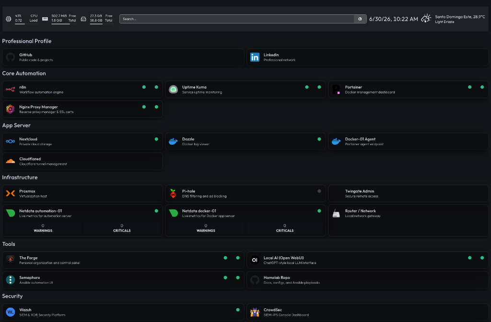
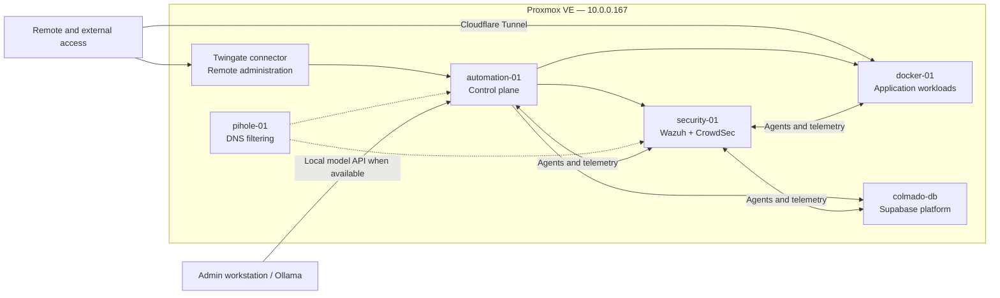

# YZEE Labs Homelab

This repository documents an actively operated homelab used to build and study virtualization, self-hosted applications, infrastructure automation, security monitoring, and local AI workflows.

It is an infrastructure portfolio and operating record—not a turnkey distribution or a lab that readers are expected to clone and deploy unchanged. The Compose files, playbooks, workflows, and scripts are included as implementation evidence behind the architecture.

> Observed state was last reconciled against the running environment on **2026-06-21**. Planned work is labeled separately from deployed state.

## What is being built

The environment separates management services, application workloads, data services, and security tooling across Proxmox guests. This keeps the control plane available when an application host is being maintained and gives security telemetry its own resource boundary.

## Infrastructure at a glance

| Layer | Platform | Role |
| --- | --- | --- |
| Virtualization | Proxmox VE 8.4 | Runs four VMs and two infrastructure LXCs |
| Control plane | Debian 13 VM | n8n, Semaphore, reverse proxy, dashboards, monitoring, Docker management, and local-AI UI |
| Applications | Debian 12 VM | Nextcloud, log viewing, metrics, container management agent, and Cloudflare Tunnel |
| Data platform | Ubuntu 24.04 VM | Thirteen-container self-hosted Supabase stack for application development |
| Security | Ubuntu 22.04 VM | Wazuh manager/indexer/dashboard and CrowdSec central API |
| Network services | Two Ubuntu 24.04 LXCs | Pi-hole filtering and Twingate remote access |

The primary network is `10.0.0.0/24`. Internal HTTP services are consolidated behind Nginx Proxy Manager with DNS-01 certificates. Twingate provides private administrative access, while Cloudflare Tunnel exposes only selected application traffic.

## Platforms and applications

- **Automation and operations:** n8n, Ansible, Semaphore, Watchtower, and custom shell/Python automation.
- **Application platform:** Nextcloud, Supabase, Life Control Center, Gotenberg, and supporting PostgreSQL/Redis services.
- **Management:** Homepage, Portainer, Dozzle, and Nginx Proxy Manager.
- **Observability:** Uptime Kuma and Netdata, supplemented by n8n health and capacity reports.
- **Security:** Wazuh agents and SIEM components, CrowdSec agents/LAPI/firewall bouncers, host firewalls, and SSH event notifications.
- **Local AI:** Open WebUI on the control plane with Ollama running on the admin workstation when it is connected to the lab network.

See the [service catalog](docs/Service%20Catalog.md) for workload placement and supporting components.

## How the lab is operated

- The public GitHub repository is the source of truth for sanitized infrastructure code and public documentation.
- Semaphore executes the version-controlled Ansible playbooks used for patching, health checks, Docker maintenance, and security-agent management.
- n8n runs scheduled reports, remediation workflows, workflow exports, and business-process automations.
- Uptime Kuma checks service availability; Netdata provides host and container metrics; Wazuh and CrowdSec cover security events and enforcement.
- Stateful services are intentionally excluded from broad unattended container upgrades.

Reliability work is still in progress. Application-level backups exist, but hypervisor backup storage is currently unavailable and restore testing is not yet complete. Those gaps are documented openly in [Operations and Reliability](docs/Operations%20and%20Reliability.md).

## Documentation

Start with the [documentation map](docs/README.md):

- [Architecture](docs/Architecture.md) — hosts, networks, boundaries, and traffic flows.
- [Service Catalog](docs/Service%20Catalog.md) — deployed platforms, applications, and placement.
- [Operations and Reliability](docs/Operations%20and%20Reliability.md) — automation, monitoring, security, backups, and known gaps.
- [Host records](docs/Servers) — per-guest implementation notes.
- [Service records](docs/services) — service-specific configuration and operating notes.
- [Runbooks](docs/Runbooks) — selected Ansible, updates, security, and dashboard procedures.

## Public/private boundary

Public content includes sanitized Compose definitions, playbooks, scripts, workflow exports, topology, and service documentation. Runtime credentials, tokens, certificates, private domains, and unredacted operational notes remain local. The export pipeline redacts n8n secrets before committing them.

The repository shows how the system is designed and operated. It deliberately does not promise that another environment can be reproduced by cloning it.
