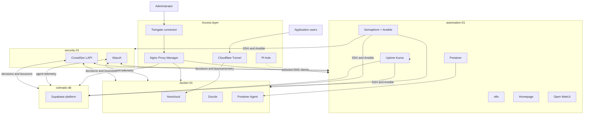

# Architecture

**State:** Observed
**Last reviewed:** 2026-06-21

## Design intent

The lab is organized around four operating planes:

- **Control:** automation, orchestration, reverse proxying, dashboards, and service monitoring.
- **Application:** user-facing and supporting application workloads.
- **Data:** a self-hosted Supabase development platform with its own compute and storage boundary.
- **Security:** central event collection, analysis, and distributed threat enforcement.

The separation is deliberate: maintenance or failure of `docker-01` should not also remove the tools used to diagnose and repair it.

## Compute inventory

| ID | System | Type | Address | Allocated resources | Operating system | Responsibility |
| --- | --- | --- | --- | --- | --- | --- |
| Host | `proxmox` | Bare metal | `10.0.0.167` | 4 logical CPUs, 20.8 GiB RAM, 238.5 GB NVMe | Proxmox VE 8.4.19 | Virtualization and guest lifecycle |
| 999 | `automation-01` | VM | `10.0.0.67` | 2 vCPU, 4 GB max RAM, 60 GB disk | Debian 13 | Control plane |
| 102 | `docker-01` | VM | `10.0.0.33` | 4 vCPU, 4 GB max RAM, 150 GB disk | Debian 12 | Application workloads |
| 101 | `colmado-db` | VM | `10.0.0.35` | 2 vCPU, 8 GB RAM, 50 GB disk | Ubuntu 24.04 | Supabase development platform |
| 109 | `security-01` | VM | `10.0.0.40` | 2 vCPU, 4 GB RAM, 60 GB disk | Ubuntu 22.04 | Wazuh and CrowdSec control services |
| 105 | `pihole-01` | LXC | `10.0.0.20` | 512 MB RAM, 6 GB disk | Ubuntu 24.04 | DNS filtering and local records |
| 104 | `twingate-connector` | LXC | `10.0.0.34` | 512 MB RAM, 3 GB disk | Ubuntu 24.04 | Private remote access |

Memory ballooning is enabled for the two general-purpose Debian VMs, so observed guest memory may be below the configured maximum.

## Network and access

| Component | Current role |
| --- | --- |
| `10.0.0.0/24` | Primary LAN for hosts, guests, and administrative clients |
| `10.0.0.1` | Default gateway and DNS path for most systems |
| Pi-hole | Directly used by selected systems and local service records; it is not yet the network-wide resolver |
| Nginx Proxy Manager | Internal HTTPS entry point and certificate termination for management applications |
| Twingate | Private administrative access without directly exposing management ports |
| Cloudflare Tunnel | Selected external application ingress through `docker-01` |
| `10.16.30.0/24` | Additional isolated Proxmox bridge; present but not yet fully documented or used as the primary service network |

## System relationships

## Boundaries and dependencies

- The control plane and application plane are separate VMs but share the same physical host and primary LAN; this is operational separation, not physical fault isolation.
- `security-01` centralizes analysis, while CrowdSec agents and firewall bouncers enforce decisions on individual Linux hosts.
- Open WebUI depends on Ollama on the admin workstation. Local model access is unavailable when that workstation is off or away from the lab network.
- Several externally reachable application paths depend on Cloudflare Tunnel on `docker-01`; management interfaces remain intended for private access.
- The single Proxmox host and its local NVMe remain shared failure domains for all guests.
