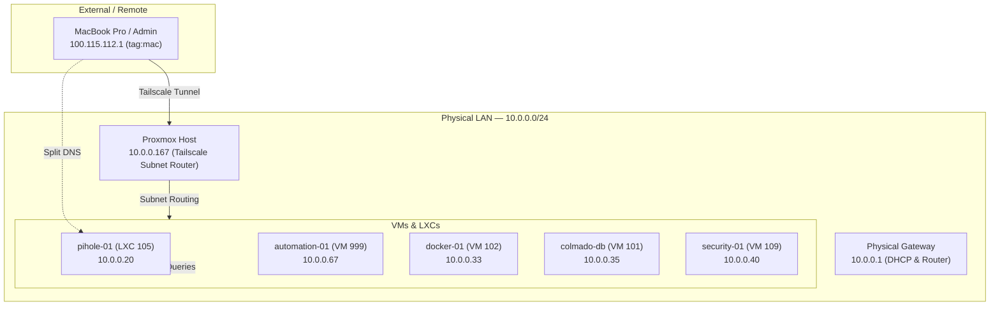

# Network Map & Configuration

This document is the canonical source of truth for the homelab network topology, IP allocations, DNS routing, and secure remote access configurations.

---

## 🗺️ Network Overview

The homelab runs on a single physical Proxmox VE hypervisor connected to a primary physical LAN segment. Remote access is established via an encrypted Tailscale mesh network with a central subnet router.



---

## 🏷️ IP Allocations & Host List

All local interfaces are bound to the `10.0.0.0/24` subnet. Interfaces running Tailscale are assigned a CGNAT address in the `100.64.0.0/10` block.

| Hostname | LAN IP | Tailscale IP | Type | OS | Primary Roles & Services |
| :--- | :--- | :--- | :--- | :--- | :--- |
| **`gateway`** | `10.0.0.1` | — | Physical | RouterOS/Proprietary | Gateway, DHCP Server, Firewall |
| **`budgetnote-win01`**| `10.0.0.15` | — | VM (103) | Windows Server | Windows Lab Server |
| **`pihole-01`** | `10.0.0.20` | — | LXC (105) | Ubuntu 24.04 | Primary DNS Resolver, Ad-blocking |
| **`docker-01`** (Tailscale: `docker`) | `10.0.0.33` | `100.111.220.29` | VM (102) | Debian 12 | Nextcloud, Cloudflare Tunnel |
| **`colmado-db`** (Tailscale: `yzee`) | `10.0.0.35` | `100.73.70.23` | VM (101) | Ubuntu 24.04 | Supabase PostgreSQL Dev Database |
| **`security-01`** | `10.0.0.40` | `100.95.167.60` | VM (109) | Ubuntu 22.04 | Wazuh Manager, CrowdSec LAPI |
| **`automation-01`** | `10.0.0.67` | `100.116.91.110` | VM (999) | Debian 13 | n8n, Semaphore, Nginx Proxy Manager |
| **`proxmox`** | `10.0.0.167`| `100.70.144.80` | Host | Proxmox VE 8.4 | Hypervisor, Subnet Router, Exit Node |
| **`yzees-mac-mini`** | *Dynamic* | `100.115.112.1` | Client | macOS | Admin Workstation (Untagged - `ycianno@github`) |

---

## 🌐 Domain Names & DNS Topology

Internal applications use the private domain segment **`local.ycianno.uk`**.

### 1. DNS Resolution Path
* **Internal Resolution**: Local DNS records are maintained in **`pihole-01`** (`10.0.0.20`).
* **Remote Resolution (Split DNS)**: Configured in the Tailscale DNS Console to direct any query ending in `*.local.ycianno.uk` to the Pi-hole nameserver (`10.0.0.20`) through the subnet router.
* **Fallback Resolver**: Public DNS requests fallback to upstream resolvers (configured in Pi-hole).

### 2. DNS-01 SSL Wildcards
SSL certificates are issued for `*.local.ycianno.uk` using **Let's Encrypt DNS-01 validation** via Cloudflare API. This allows secure `https://` access for internal domains without exposing HTTP ports to the public internet.

---

## 🔒 Nginx Proxy Manager (Reverse Proxy)

All web interfaces are proxied behind **Nginx Proxy Manager** (running on `automation-01` at `10.0.0.67:81`).

* **SSL Termination**: Wildcard certificate for `*.local.ycianno.uk`.
* **Port Mappings**: NPM binds to `80` and `443` on `automation-01`. DNS records in Pi-hole point CNAMEs/A-records to `10.0.0.67`.

| Application URL | Internal Destination | Description |
| :--- | :--- | :--- |
| `http://n8n.local.ycianno.uk` | `10.0.0.67:5678` | n8n Automation Workspace |
| `https://pihole.local.ycianno.uk` | `10.0.0.20:80` | Pi-hole Admin Interface |
| `https://kuma.local.ycianno.uk` | `10.0.0.67:3001` | Uptime Kuma Status Monitor |
| `https://semaphore.local.ycianno.uk` | `10.0.0.67:3005` | Ansible Semaphore Console |
| `https://portainer.local.ycianno.uk` | `10.0.0.67:9443` | Portainer Docker Console |

---

## ✈️ Tailscale Remote Routing Architecture

Tailscale handles secure access to management ports and local subnets without opening firewall ports.

### 1. Subnet Router Configuration
The Proxmox host (`10.0.0.167`) acts as the subnet router.
* **Advertised Route**: `10.0.0.0/24`
* **Configuration Command**:
  ```bash
  tailscale set --advertise-routes=10.0.0.0/24 --advertise-exit-node
  ```
* **IP Forwarding**: Persistently enabled in `/etc/sysctl.d/99-tailscale.conf`:
  ```ini
  net.ipv4.ip_forward = 1
  net.ipv6.conf.all.forwarding = 1
  ```
* **Client Expectation**: Connecting clients (like your Mac Mini) must enable **"Use Tailscale subnets"** in their local settings to route the `10.0.0.0/24` range over the VPN.

### 2. Tailscale SSH (Keyless Administration)
Server administration uses Tailscale identity-based SSH instead of standard public SSH keys.
* **Active Nodes**: `automation-01`, `docker` (local VM `docker-01`), `yzee` (local VM `colmado-db`), `security-01`, `proxmox`.
* **Source Restrictions**: Connections originating from untagged admin members (`ycianno@github` / `autogroup:member`) bypass SSH key verification. Connections from `automation-01` (`tag:automation`) are authorized for Ansible automation tasks. Note that the Mac Mini must remain **untagged**; assigning a resource tag removes its user identity context and blocks its ability to initiate SSH under Tailscale SSH ACL rules.
* **Mac Mini (GUI Sandbox Exception)**: The macOS GUI Tailscale client runs sandboxed and cannot act as a Tailscale SSH *server*. Therefore, connections entering the Mac (like n8n fetching docs) fallback to traditional SSH key authentication but are securely routed over the Mac's static Tailscale IP (`100.115.112.1`).
