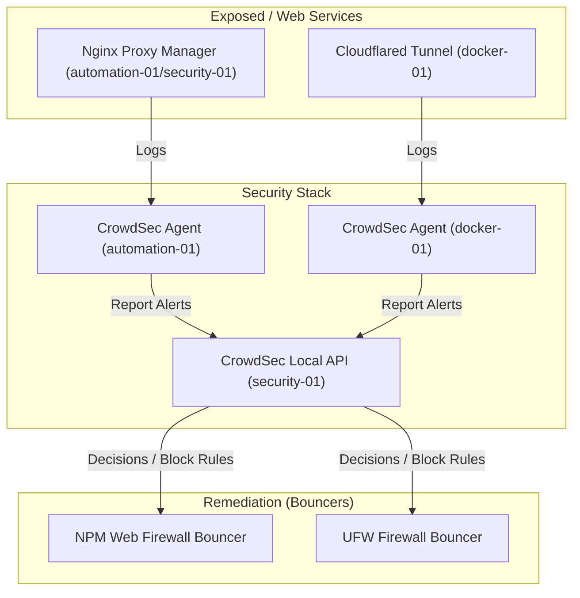

# CrowdSec IPS Blueprint — security-01

This directory covers the deployment roadmap and architecture for **CrowdSec**, a modern Intrusion Prevention System (IPS) that leverages community-driven threat intelligence.

## CrowdSec Architecture

## Setup Plan

### 1. Central Local API (LAPI)
- Deploy CrowdSec central engine on `security-01` (`10.0.0.9`) to host the Local API database.
- Centralize alert logs and coordinate block decisions across the network.

### 2. Distributed CrowdSec Agents
- Install CrowdSec agent services on `automation-01` and `docker-01`.
- Configure agents to monitor specific service logs:
  - **Nginx Proxy Manager access logs** (detect HTTP brute-force, web scrapers, path traversal attempts).
  - **SSH secure logs** (detect system credential brute forcing).
  - **Nextcloud security logs** (detect application login brute forcing).

### 3. Remediation Bouncers
- **Nginx Bouncer:** Deploy an OpenResty/Nginx Lua bouncer inside Nginx Proxy Manager to intercept malicious HTTP requests immediately and present captcha/block pages.
- **Firewall Bouncer:** Deploy the `crowdsec-firewall-bouncer` on Linux hosts to drop traffic at the UFW level using iptables/ipset tables.
