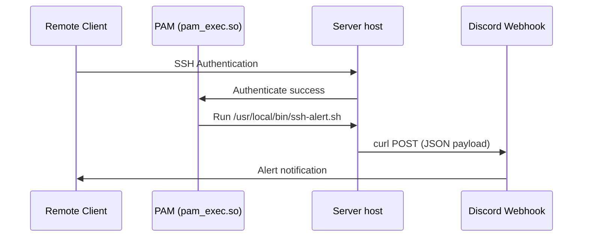

# SSH Success Login Alerts to Discord — Blueprint

This directory documents the deployment configuration for automated SSH login notifications. It triggers an instant alert via a Discord webhook whenever a user successfully logs into a homelab server via SSH.

## Implementation Flow



## PAM Configuration Setup

To implement this on a server, follow these steps:

### 1. Create the Notification Script
Place the script below at `/usr/local/bin/ssh-alert.sh` and make it executable (`chmod +x`):

```bash
#!/bin/bash

# Webhook URL (Managed via environment variables or file, do NOT commit actual URL)
DISCORD_WEBHOOK_URL="https://discord.com/api/webhooks/YOUR_PLACEHOLDER_WEBHOOK_HERE"

# Only trigger on open/session start
if [ "$PAM_TYPE" = "open_session" ]; then
    PAYLOAD=$(cat <<EOF
{
  "embeds": [{
    "title": "🚨 SSH Login Detected",
    "color": 15158332,
    "fields": [
      { "name": "Host", "value": "$(hostname)", "inline": true },
      { "name": "User", "value": "$PAM_USER", "inline": true },
      { "name": "Client IP", "value": "$PAM_RHOST", "inline": true },
      { "name": "Timestamp", "value": "$(date '+%Y-%m-%d %H:%M:%S')", "inline": true }
    ]
  }]
}
EOF
)

    curl -H "Content-Type: application/json" -X POST -d "$PAYLOAD" "$DISCORD_WEBHOOK_URL"
fi
```

### 2. Update PAM Common Session
Append the execution trigger to `/etc/pam.d/common-session` on the target host:

```text
session optional pam_exec.so seteuid /usr/local/bin/ssh-alert.sh
```

## Secret Security
Do **not** commit actual Discord webhook URLs to Git. Instead:
- Use a placeholder in version controlled files.
- Load the webhook URL from a protected environment file or local system config (e.g. `/etc/ssh_alert_webhook`).
