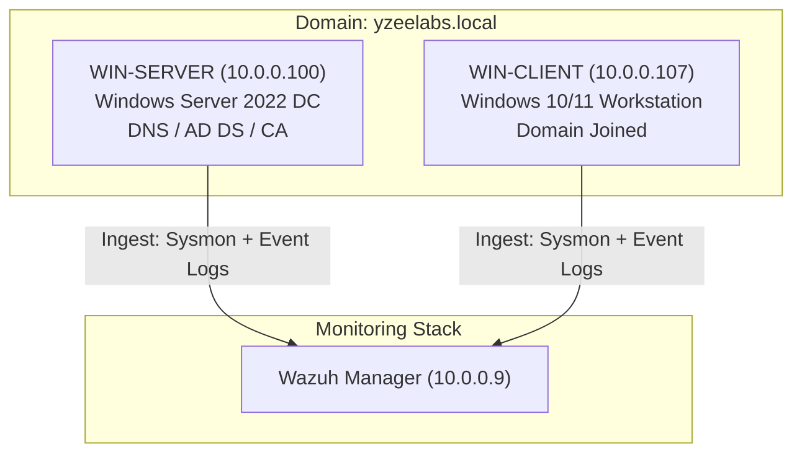

# Windows AD Security Lab — WIN-SERVER & WIN-CLIENT

This directory documents the setup design and security auditing guidelines for the **Windows Active Directory Security Lab** hosted on Proxmox. The primary purpose of this lab is to study domain security, GPO hardening, and security event log auditing.

## Lab Architecture

## System Allocations

### 1. Domain Controller — `WIN-SERVER`
- **VM ID:** `100`
- **RAM:** 8 GB
- **OS:** Windows Server 2022 Evaluation
- **Services:** Active Directory Domain Services (AD DS), DNS Server, Active Directory Certificate Services (AD CS).
- **Domain Name:** `yzeelabs.local`

### 2. Client Workstation — `WIN-CLIENT`
- **VM ID:** `107`
- **RAM:** 4 GB
- **OS:** Windows 10/11 Pro Evaluation
- **Role:** Joined to `yzeelabs.local` domain, simulating client logins and software deployment targets.

---

## Hardening & Auditing Blueprint

### Group Policy Objects (GPOs)
Implement the following security baselines using Local GPO policies or AD GPOs:
1. **Account Lockout Policy:** Set lockout threshold to 5 invalid attempts for 15 minutes.
2. **Password Policy:** Enforce minimum length of 14 characters, complexity requirements, and history count.
3. **Audit Policy (Advanced Audit Policy Configuration):**
   - Audit Logon/Logoff: Success/Failure
   - Audit Process Creation: Success/Failure (critical for tracking malware execution)
   - Audit Directory Service Access: Success/Failure
   - Audit Account Management: Success/Failure

### Sysmon Integration
Deploy Microsoft System Monitor (Sysmon) on both the DC and client workstation to capture rich telemetry:
- Use the curated security schema (e.g. **SwiftOnSecurity's sysmon-config**).
- Sysmon captures crucial details:
  - Event ID 1: Process Creation (with cmdline arguments and parent process hashes).
  - Event ID 3: Network Connection.
  - Event ID 11: File Create.
  - Event ID 12/13/14: Registry Event.

### Log Forwarding
Configure the Wazuh Agent on Windows hosts to read both:
- Windows Event Logs (`Security`, `System`, `Application`).
- Sysmon Event Logs (`Microsoft-Windows-Sysmon/Operational`).
Telemetry will be forwarded to the Wazuh Manager at `10.0.0.9` for correlation.
